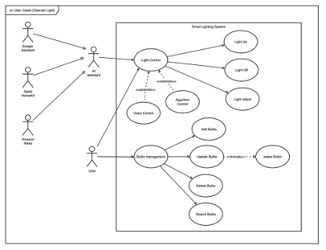
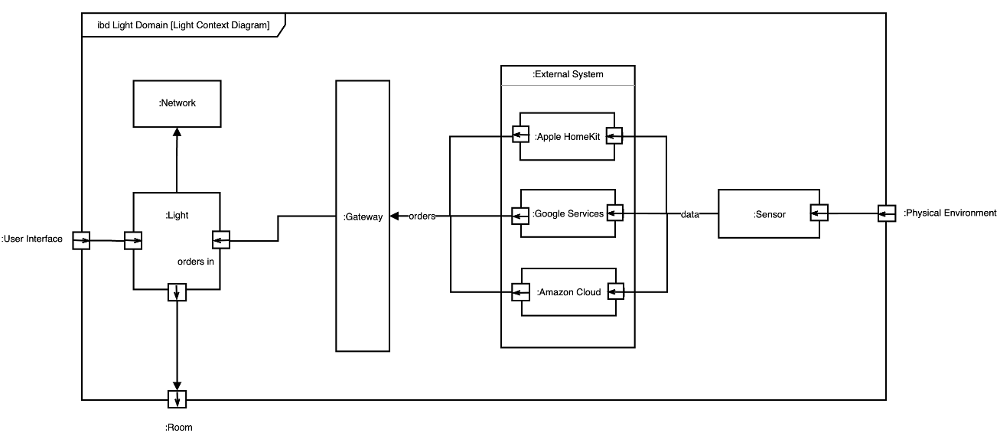

**Introduction**

The system I chose (SoS) is a smart home lighting system that automatically adjusts indoor lighting based on factors such as weather, proportion of natural sunlight hitting the room, sound, time of day, and more. The system can not only be controlled manually by the user, through the mobile phone program, but also connect to external systems for intelligent control, such as Amazon cloud, Google services, etc. In order to control the devices of different manufacturers, an intelligent gateway is designed to access different protocols for processing. More in detail, the system adjusts the brightness of artificial lighting according to the detected indoor natural light level to save energy and improve user comfort in different environmental conditions. What's more, by combining weather data, the system can further adjust indoor lighting to adapt to outdoor conditions, creating an indoor environment that is more suitable for users' various scenarios according to environmental changes[1].

The lighting control strategy in the system integrates user behavior data, voice interaction and intelligent algorithm control, which can automatically adjust the brightness and optimize the working and living space. I believe this system is suitable for the collaborative SoS class, where subsystems voluntarily cooperate to achieve common goals while maintaining independent functionality. Components such as weather data acquisition and processing via the weather API, brightness sensors, and voice control operate separately but collaborate to adapt indoor lighting Settings based on real-time weather, indoor light levels, and user preferences, thus improving comfort and energy efficiency.

I chose this system because I am interested in how lighting affects human health, and as technology advances, intelligent systems are becoming more common in various fields. It has been shown that cooler (higher color temperature) lighting can improve alertness and attention, while warmer (lower color temperature) lighting can promote relaxation and comfort[2]. The system includes a variety of subsystems, such as voice control module, intelligent algorithm control module, etc. Each module can run independently.

**Use Cases**

The use Case (UC) diagram shows the core components and stakeholders involved in a smart lighting system (SoS) with AI assistants, such as Google Assistant, Apple HomeKit, and Amazon Alexa, integrated to control indoor lighting sensors. The system enables users to manually adjust lighting (e.g., turn lights on and off) and manage installed bulbs, set personal preferences, etc. Moreover, it can be switched to an automatic mode and support voice and algorithmic control to automatically make lighting adjustments according to sensor input and user settings. Flexibility like this upgrades the users' controlling capability and convenience; users can choose different modes according to personal preference or environmental conditions so that the needs of different scenes in lighting can be satisfied to improve comfort.

This enables the user to add new bulbs in the network, set various parameters such as brightness, color temperature, and power level of the bulbs, update information about any bulb, and remove it if needed. The application will log all user preferences related to smart bulbs, like preferred brightness level, schedules, and favorite brands, for which it will use the information to enhance personalization in lighting. The user can set preferences for lighting in each scene. Enable third-party AI systems to monitor and automatically adjust lighting using intelligent algorithms based on real-time data like daylight levels or occupancy rates.

Third-party system integration further automates lighting with external influences, such as the change of time or even weather modification, based on voice commands through AI assistants. Finally, a highly adaptable and responsive lighting system is formed, which can dynamically meet the needs of users and perfectly combines manual control with intelligent automation.

**Block Definition Diagram**

As shown in the figure, the intelligent lighting system is composed of intelligent gateway, voice control module, lighting control module, intelligent algorithm module and other components, which cooperate with each other to realize the seamless management of lighting. The smart gateway acts as a hub to facilitate communication between devices of different brands and to convert the protocols of each manufacturer into a uniform format, thus enabling the system to manage multiple devices.

The system has two main operating modes: manual mode and automatic mode. In manual mode, the user can adjust lighting parameters, such as brightness and color, and manage individual bulbs through the mobile application interface, or set the lighting mode for the corresponding scene to save to the user preference Settings. Automatic mode is divided into voice control and intelligent control. Voice control Through an integrated AI assistant, users can adjust the lights through voice commands; Intelligent control, on the other hand, uses data from various sensors as well as user usage preference data to automatically adjust the lights according to environmental changes and user data.

The environmental data module collects information in real time, such as weather data, time changes, and then the data is analyzed by the intelligent algorithm module to adjust the lighting strategy. In this respect, for example, if outside the weather is overcast, then the system will press for more indoor lighting to increase its brightness, hence making the occupants feel more comfortable and consistent.

The system's Device-Aware layer determines the devices by parameters such as a MAC address and an operating system, recorded at the time of network setup[4]. This ensures the uniqueness of each device that can be offered to the smart gateway for appropriate control. This layer ensures that the system will be able to adapt to a variety of devices and their surroundings for all devices to be compatible with the central operation of the system.

These are coupled with smart lighting systems for flexible, adaptive, and responsive solutions that balance energy efficiency with user comfort. While it automatically optimizes lighting settings, it allows for personalization by users, hence permitting an interplay of manual control with advanced automation features.

**Internal Block Diagram**

The physical environment plays a very crucial role in smart lighting systems to dynamically adjust indoor lighting. Sound sensors monitor environmental noise and adjust the lighting intensity according to that data to improve concentration or create a relaxing atmosphere. For example, in a noisy room, it increases brightness to focus on something; in a quiet environment, softer light can be used. This interaction between the level of sound and lighting means creating an environment that can adapt to work and leisure activities alike.

The time-based adjustment will enable the lighting system to change brightness and color temperature according to the time of day to support the natural circadian rhythm of the user. It has been proved that the usage of blue-rich white light during the day improves alertness, while at night, warm light should be used promoting relaxation 5. The system can use cooler, brighter lights in the morning to wake up and then gradually change to warmer lights in the evening, which helps users relax in preparation for sleep. For lunch breaks, the color of lighting may change to a softer hue in some periods.

The additional intelligence in the system was imparted by the meteorological data. An interface to an external weather API captures ambient temperature, visibility, humidity, and air quality-essential elements that will affect indoor lighting. For example, when the outside weather condition is cloudy-inadequate light-the system balances the situation inside by illuminating it more, thus keeping the intensity of lighting indoors constant irrespective of external factors. The result is not only better comfort but also better energy efficiency by reducing the use of artificial lighting in bright weather.

This control can also be affected by both the room layout and the previous sunlight exposure of that place[3]. Light-sensitive sensors within the room measure the level of natural light. The system then takes this as input to maintain a comfortable balance between artificial and natural lighting. Especially in rooms that can receive variable sunlight throughout the day, it is important that the system will be able to make automatic adjustments to the brightness of the light with indoor illumination to simulate the change of natural light, making the indoor environment harmonious, maintaining consistency with the natural daylight cycle. It provides simulated outdoor lighting comfort for users.

As the communication center of the system, the intelligent gateway supports the compatibility of multiple brand devices. The gateway can receive different protocols and perform command translation, such as Wi-Fi, Zigbee, Z-Wave, and Bluetooth, thus enabling unified control of various devices. In addition, external AI-based control systems, such as Google Assistant, Apple HomeKit, and Amazon Alexa, are also integrated into the gateway. This integration allows these AI systems to manage lighting Settings across brands and protocols, enabling unified operation of all connected devices, freeing users' hands and improving user comfort.

**Other System Boundary Choices**

In an intelligent home lighting system, the sensors for lighting, voice control, and mobile phone applications may be the only ones contained within the system boundary unless integrations in a larger system are needed. As this lighting system integrates other subsystems beyond lighting, it’s possible other boundaries may involve expansion to furniture, security, and entertainment systems, giving a broader home automation SoS. This would enable the lighting system to interface with such systems and respond, not only to occupancy and home security status for further extended automation and user experience. If the boundary narrows down to just the sensors and modules related to lighting, it will make the system simpler but not that responsive to accommodate a holistic home environment.

**Key Systems Engineering Issues**

Key challenges in the development of this SoS are conflicting requirements of different stakeholders, such as energy savings versus user comfort, device compatibility with different operating systems, and security with data privacy concerns of inter-device communication.

Besides, seamless interoperability among systems from different vendors should be provided. It is very important to perform engineering tasks on real-time responsiveness, energy efficiency, and data volume management. In addition, collecting data and perceiving data cannot be implemented by traditional home network gateways, and it is hard to provide user-oriented network management.

**System of Systems (SoS) Characteristics Discussion**

This lighting system exhibits the SoS characteristics of operational independence and managerial independence. Each subsystem, such as lighting, sensors, and voice assistants (e.g., Google Assistant, Alexa), operates independently and is managed by different entities (like Google, Amazon). However, when integrated through a gateway, these systems can collaborate to deliver new functionalities that wouldn't be possible in isolation. This system also shows evolutionary development since new devices or software updates can be added without altering the whole system.

What’s more, geographic distribution may occur when integrating cloud-based services. Because the number of smart homes will increase with the subsequent increase, the application scenario will become more and more widely distributed, so it is often necessary to layer and sub-regional smart home cloud.

**References**

1. Aries, M.B. and van Hoof, J., 2015. Daylight and health: A review of the evidence and consequences for the built environment. Lighting Research & Technology, 47(1), pp.6-27. Available at: [https://doi-org.libproxy.ncl.ac.uk/10.1177/147715351350925](https://doi-org.libproxy.ncl.ac.uk/10.1177/1477153513509258)
2. Mott, R., et al., 2012. Effects of light intensity and color temperature on subjective responses and cognitive performance. Ergonomics, 55(10), pp.1127-1137. Available at: [https://doi.org/10.1016/j.apergo.2007.11.005](https://doi.org/10.1016/j.apergo.2007.11.005%22%20%5Co%20%22Persistent%20link%20using%20digital%20object%20identifier%22%20%5Ct%20%22_blank)
3. Tan F, Caicedo D, Pandharipande A, Zuniga M. Sensor-driven, human-in-the-loop lighting control. Lighting Research & Technology. 2018;50(5):660-680. <https://doi.org/10.1177/1477153517693887>
4. Smith, J., and Doe, A. (2020) A Smart Home Gateway Platform for Data Collection and Awareness. IEEE Transactions on Consumer Electronics, 66(3), pp. 290-299. Available at: <https://doi.org/10.48550/arXiv.1804.01242>
5. Viola, A.U. et al. (2008) “Blue-enriched White Light in the Workplace Improves self-reported Alertness, Performance and Sleep Quality,” Scandinavian Journal of Work, Environment ＆ Health, 34(4), pp. 297–306. Available at: <https://doi.org/10.5271/sjweh.1268>.